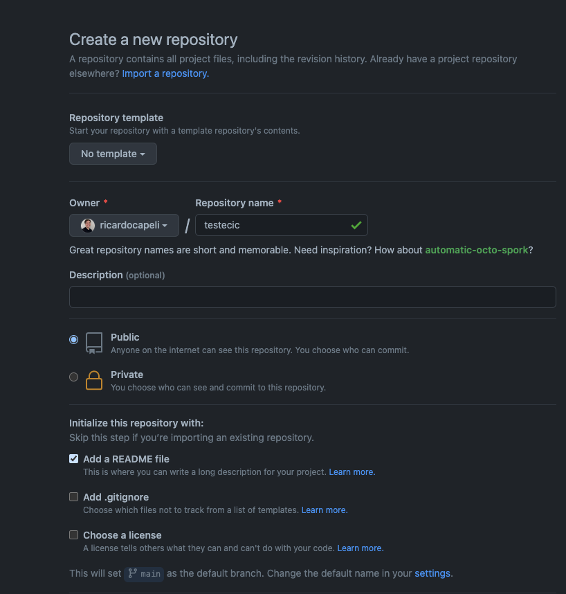
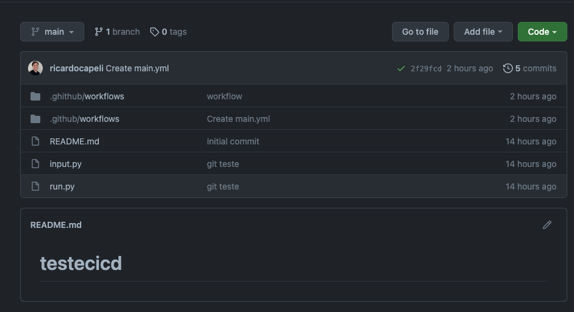
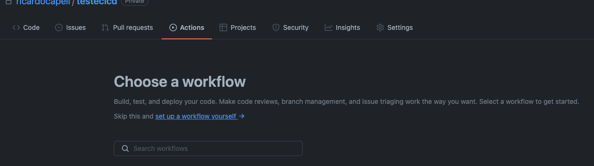
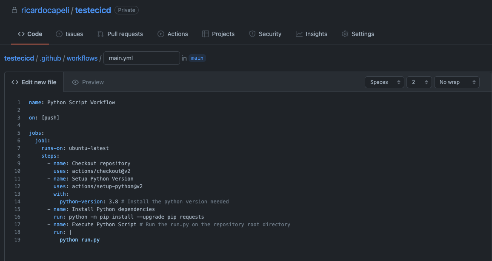
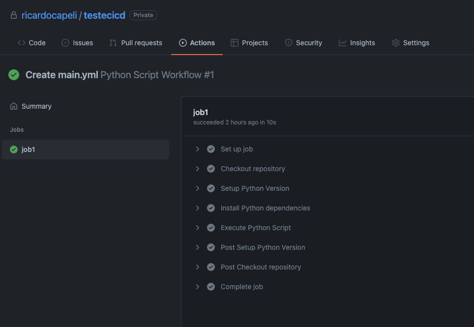

# Exercicios teoricos

1. Realizem uma pesquisa a respeito de DevOps, CI e CD e montem um resumo. Depois deve ser feita uma apresentação oral explicando o que foi encontrado.
2. Tragam uma relação de ferramentas que realizem CI/CD.

# Exercicios Praticos

1. Crie um programa em python (ou qualquer outra linguagem que deseje) e entao crie um pipeline com a opcao de CI que efetue as seguintes acoes:
   - Seja executado na distribuicao ubuntu;
   - Faca checkout do repositorio;
   - Instalar a versão do Python específica que desejamos usar;
   - Instalar as dependências ou bibliotecas. Neste caso, vamos usar um comando shell utilizando pip para fazer a instalação da biblioteca requests;
   - E para finalizar vamos executar a nossa aplicacao.

Etapas para execucao:

Para a primeira etapa vamos criar um repositório no github. Vamos dar o nome do projeto _testecicd_ 



Agora realize o clone deste repositório na sua maquina e então coloquei o seu codigo da sua aplicação. Neste exemplo vou utilizar uma aplicação que consome uma API

```
### PYTHON NATIVE DEPENDENCIES
import json

### DEPENDENCIES TO IMPORT ON THE GH WORKFLOW
import requests

### SCRIPT SAMPLE EXECUTED THROUGH GH WORKFLOW
print(f"💡 \033[36mScript example: Getting Brazil Covid-19 datas\033[0m")

try:
  response1 = requests.get("https://covid-api.mmediagroup.fr/v1/cases?country=Brazil")

  country_datas = response1.json()

  cases = country_datas["All"]

  print("🤒 🇧🇷 Confirmed cases:", cases["confirmed"])
  print("🥳 🇧🇷 Recovered cases:", cases["recovered"])
  print("😢 🇧🇷 Deaths:", cases["deaths"])

except:
   print("Couldn't extract Brazil cases datas") 

try:    
  response2 = requests.get("https://covid-api.mmediagroup.fr/v1/vaccines?country=Brazil")

  vaccines_datas = response2.json()

  vaccines = vaccines_datas["All"]

  print("📦 🇧🇷 Vaccines quantity:", vaccines["administered"])
  print("💉 🇧🇷 Vaccinated people:", vaccines["people_vaccinated"])

except:
  print("Couldn't extract Brazil vaccines datas") 
```

Com o nosso codigo pronto, envie este codigo para o repositório e verifique se ele esta disponivel via browser.



Vá ate a opção _Actions_ no github e cliente em "set up a workflow yourself".



Você será redirecionado para uma pagina onde já possui um esqueleto de um codigo que são os comandos e as sequencias que devem ser executadas as estapas do nosso pipeline. Você pode customizar como quiser. Para este exemplo vamos inserir o codigo abaixo:

```
name: Python Script Workflow

on: [push]

jobs:
  job1:
    runs-on: ubuntu-latest
    steps:
      - name: Checkout repository
        uses: actions/checkout@v2
      - name: Setup Python Version
        uses: actions/setup-python@v2
        with:
          python-version: 3.8 # Install the python version needed
      - name: Install Python dependencies
        run: python -m pip install --upgrade pip requests
      - name: Execute Python Script # Run the run.py on the repository root directory
        run: |
          python run.py
```

O que este script esta fazendo?

Basicamente estamos dando um nome e as etapas a serem realizadas.

Repare também que o proprio github esta criando um arquivo dentro de duas pastas que não existia em nosso projeto.



Apos a criação vá novamente ate a aba Actions no gihub e então veja o workflow executado.

