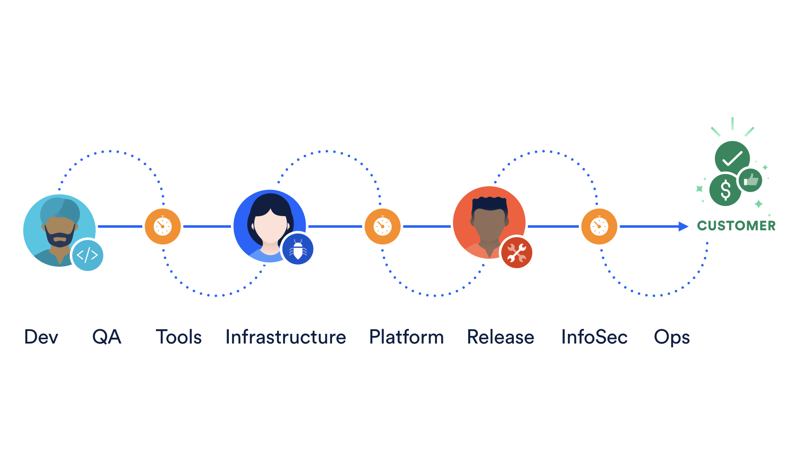
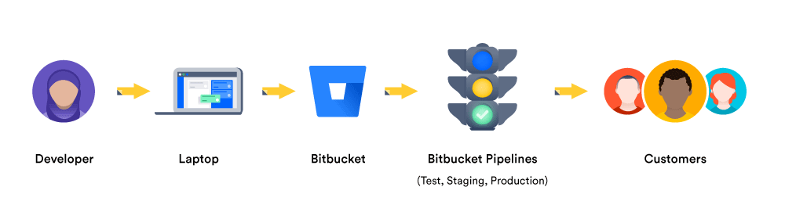

# **Continuous delivery - CD**

## O que é CD?

CD (Continuous delivery) é uma abordagem em que as equipes lançam produtos de qualidade com frequência e de forma previsível do repositório de código-fonte para a produção de maneira automatizada.

Algumas organizações lançam produtos manualmente, passando-os de uma equipe para a outra. Veja o diagrama abaixo. Normalmente, os desenvolvedores estão na extremidade esquerda desse espectro e o pessoal de operações está na extremidade receptora. Há atrasos em cada transferência que leva a equipes frustradas e clientes insatisfeitos. O produto acaba entrando em operação por meio de um processo tedioso e sujeito a erros que atrasa a geração de receita.

Agora verifique o pipeline de entrega contínua abaixo. Ele ilustra como os desenvolvedores escrevem código em seus laptops e fazem o commit dessas alterações em um repositório de código-fonte, como o Bitbucket. Por código, queremos dizer o sistema em teste, os testes e a infraestrutura que será usada para implantar e manter o sistema. O Bitbucket Pipelines pode enviar o produto do teste à preparação e à produção, e ajudar os clientes a colocarem as mãos nesses novos recursos brilhantes.

Um pipeline de entrega contínua pode ter um portão manual antes da produção. Uma porta manual requer intervenção humana e pode haver cenários em sua organização que exijam portas manuais em pipelines. Algumas portas manuais podem ser questionáveis, enquanto outras podem ser legítimas. Um cenário legítimo permite que a equipe de negócios tome uma decisão de liberação de última hora. A equipe de engenharia mantém uma versão do produto pronta para entrega após cada sprint, e a equipe de negócios faz a chamada final para liberar o produto para todos os clientes, ou uma seção transversal da população, ou talvez para pessoas que vivem em uma determinada área geográfica localização.

A arquitetura do produto que flui pelo pipeline é um fator chave que determina a anatomia do pipeline de entrega contínua. Uma arquitetura de produto altamente acoplada gera um padrão de pipeline gráfico complicado, onde vários pipelines podem ficar emaranhados antes de chegar à produção.

A arquitetura do produto também influencia as diferentes fases do pipeline e quais artefatos são produzidos em cada fase. O pipeline primeiro constrói componentes - as menores unidades distribuíveis e testáveis ​​do produto. Por exemplo, uma biblioteca construída pelo pipeline pode ser chamada de componente. Esta é a fase de componentes.

Componentes fracamente acoplados constituem subsistemas - as menores unidades implantáveis ​​e executáveis. Por exemplo, um servidor é um subsistema. Um microsserviço em execução em um contêiner também é um exemplo de subsistema. Esta é a fase do subsistema. Ao contrário dos componentes, os subsistemas podem ser montados e testados.

**Valor da entrega contínua**

O pipeline de entrega de software é um produto por si só e é uma prioridade para os negócios, caso contrário, não devemos enviar nossos produtos geradores de receita por meio dele.

A entrega contínua agrega valor de três maneiras. Ele melhora a velocidade, produtividade e sustentabilidade das equipes de desenvolvimento de software.

_Velocidade_
Velocidade significa velocidade responsável, e não velocidade suicida. Os dutos destinam-se a enviar produtos de qualidade aos nossos clientes. A menos que as equipes sejam disciplinadas, os pipelines podem enviar códigos defeituosos para a produção, mas com mais rapidez! Os pipelines de entrega de software automatizados ajudam as organizações a responder melhor às mudanças do mercado.

_Produtividade_
Um pico na produtividade ocorre quando tarefas tediosas, como enviar uma solicitação de mudança para cada mudança que vai para a produção, podem ser realizadas por pipelines em vez de humanos. Isso permite que as equipes de scrum se concentrem em produtos que impressionam o mundo, em vez de gastar suas energias na logística. E isso pode deixar os membros da equipe mais felizes, mais engajados em seu trabalho e que desejam permanecer na equipe por mais tempo.

_Sustentabilidade_
A sustentabilidade é fundamental para todos os negócios, não apenas para a tecnologia. “O software está comendo o mundo” não é mais verdade - o software já consumiu o mundo! Cada empresa no final do dia, seja em saúde, finanças, varejo ou algum outro domínio, usa a tecnologia para se diferenciar e superar sua concorrência. A automação ajuda a reduzir / eliminar tarefas manuais sujeitas a erros e repetitivas, posicionando assim o negócio para inovar melhor e mais rápido para atender às necessidades de seus clientes.