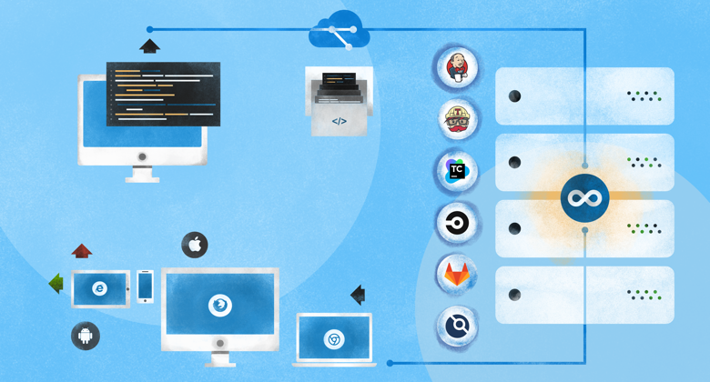

# **Continuous Integration - CI**

## O que é CI?

CI (Continuous Integration) e CD (Continuous delivery) são duas siglas frequentemente usadas em práticas de desenvolvimento moderno e DevOps. CI significa integração contínua, uma prática recomendada de DevOps fundamental onde os desenvolvedores frequentemente mesclam alterações de código em um repositório central onde compilações e testes automatizados são executados. Mas CD pode significar entrega contínua ou implementação contínua.

## O que é integração contínua?

Integração contínua (CI) é a prática de automatizar a integração de alterações de código de vários contribuidores em um único projeto de software. É uma prática recomendada de DevOps primária, permitindo que os desenvolvedores frequentemente mesclem alterações de código em um repositório central onde compilações e testes são executados. Ferramentas automatizadas são usadas para garantir a exatidão do novo código antes da integração.

Um sistema de controle de versão do código-fonte é o ponto crucial do processo de CI. O sistema de controle de versão também é complementado com outras verificações, como testes de qualidade de código automatizados, ferramentas de revisão de estilo de sintaxe e muito mais.

**A importância da integração contínua**
  
A fim de compreender a importância do IC, é útil primeiro discutir alguns pontos problemáticos que muitas vezes surgem devido à ausência de IC. Sem CI, os desenvolvedores devem coordenar e comunicar manualmente quando estão contribuindo com código para o produto final. Essa coordenação se estende além das equipes de desenvolvimento para as operações e o restante da organização. As equipes de produto devem coordenar quando lançar recursos e correções sequencialmente e quais membros da equipe serão responsáveis.

A sobrecarga de comunicação de um ambiente não CI pode se tornar uma tarefa de sincronização complexa e emaranhada, que adiciona custos burocráticos desnecessários aos projetos. Isso causa lançamentos de código mais lentos com taxas mais altas de falha, pois exige que os desenvolvedores sejam sensíveis e cuidadosos com as integrações. Esses riscos aumentam exponencialmente conforme a equipe de engenharia e os tamanhos da base de código aumentam.

Sem um pipeline de CI robusto, pode ocorrer uma desconexão entre a equipe de engenharia e o resto da organização. A comunicação entre o produto e a engenharia pode ser complicada. A engenharia se torna uma caixa preta na qual o resto da equipe insere os requisitos e recursos e talvez obtenha os resultados esperados de volta. Será mais difícil para a engenharia estimar o tempo de entrega das solicitações porque o tempo para integrar novas mudanças se torna um risco desconhecido.

**O que a CI faz?**

O CI ajuda a aumentar o número de funcionários e a produção de entrega das equipes de engenharia. A introdução da CI ao cenário mencionado permite que os desenvolvedores de software trabalhem de forma independente em recursos em paralelo. Quando eles estão prontos para mesclar esses recursos no produto final, eles podem fazer isso de forma independente e rápida. CI é uma prática valiosa e bem estabelecida em organizações de engenharia de software modernas e de alto desempenho.

**Como o CI pode ser usado?**

CI geralmente é usado junto com um fluxo de trabalho de desenvolvimento de software ágil. Uma organização irá compilar uma lista de tarefas que compõem um roteiro de produto. Essas tarefas são então distribuídas entre os membros da equipe de engenharia de software para entrega. O uso de CI permite que essas tarefas de desenvolvimento de software sejam desenvolvidas de forma independente e em paralelo entre os desenvolvedores atribuídos. Assim que uma dessas tarefas for concluída, um desenvolvedor apresentará esse novo trabalho ao sistema de CI para ser integrado ao restante do projeto.

**CI x implantação contínua x entrega contínua**

Integração, implantação e entrega contínuas são três fases de um pipeline de lançamento de software automatizado, incluindo um pipeline de DevOps. Essas três fases levam o software desde a ideia até a entrega ao usuário final. A fase de integração é a primeira etapa do processo. A integração contínua cobre o processo de vários desenvolvedores tentando mesclar suas alterações de código com o repositório de código principal de um projeto.

A entrega contínua é a próxima extensão da integração contínua. A fase de entrega é responsável por empacotar um artefato para ser entregue aos usuários finais. Esta fase executa ferramentas de construção automatizadas para gerar este artefato. Esta fase de construção é mantida "verde", o que significa que o artefato deve estar pronto para ser implantado para os usuários a qualquer momento.

A implantação contínua é a fase final do pipeline. A fase de implantação é responsável por iniciar e distribuir automaticamente o artefato de software aos usuários finais. No momento da implementação, o artefato passou com sucesso pelas fases de integração e entrega. Agora é hora de implantar ou distribuir automaticamente o artefato. Isso acontecerá por meio de scripts ou ferramentas que movem automaticamente o artefato para servidores públicos ou para outro mecanismo de distribuição, como uma loja de aplicativos.

## Práticas recomendadas de CI

Desenvolvimento Orientado a Testes
Depois que um projeto estabelece um pipeline de CI com cobertura de teste automática, é uma prática recomendada desenvolver e melhorar constantemente a cobertura de teste. Cada novo recurso vindo do pipeline de CI deve ter um conjunto de testes de acompanhamento para garantir que o novo código está se comportando conforme o esperado.

_Test Driven Development (TDD)_ é a prática de escrever o código de teste e os casos de teste antes de fazer qualquer codificação de recurso real. O Pure TDD pode envolver de perto a equipe de produto para ajudar a criar uma especificação de comportamento de negócios esperada, que pode então ser transformada em casos de teste. Em um cenário de TDD puro, os desenvolvedores e a equipe do produto se encontrarão e discutirão uma especificação ou lista de requisitos. Essa lista de requisitos será então convertida em uma lista de verificação de asserções de código. Os desenvolvedores, então, escreverão um código que corresponda a essas afirmações.

_Solicitações de pull request de código_.
A maioria das equipes modernas de desenvolvimento de software pratica um fluxo de trabalho de pull request e revisão de código. As solicitações pull são uma prática crítica para a CI eficaz. Uma solicitação pull é criada quando um desenvolvedor está pronto para mesclar o novo código na base de código principal. A solicitação pull notifica outros desenvolvedores sobre o novo conjunto de mudanças que estão prontas para integração.

As solicitações pull request são um momento oportuno para iniciar o pipeline de CI e executar o conjunto de etapas de aprovação automatizadas. Uma etapa de aprovação manual adicional é comumente adicionada no momento da solicitação de pull, durante a qual um engenheiro não envolvido realiza uma revisão de código do recurso. Isso permite que um novo par de olhos analise o novo código e funcionalidade. O não interessado fará sugestões de edição e aprovará ou negará a solicitação pull.

Solicitações pull request e revisão de código são uma ferramenta poderosa para promover a comunicação passiva e o compartilhamento de conhecimento entre uma equipe de engenharia. Isso ajuda a evitar dívidas técnicas na forma de silos de conhecimento, onde engenheiros específicos são os únicos interessados ​​em determinados recursos de uma base de código.

_Otimize a velocidade do pipeline._ Visto que o pipeline de CI será um processo central e frequentemente usado, é importante otimizar sua velocidade de execução. Qualquer pequeno atraso no fluxo de trabalho de CI aumentará exponencialmente conforme a taxa de lançamentos de recursos, o tamanho da equipe e o tamanho da base de código aumentam. É uma prática recomendada medir a velocidade do pipeline de CI e otimizar conforme necessário.

Um pipeline de CI mais rápido permite um ciclo de feedback do produto mais rápido. Os desenvolvedores podem fazer mudanças rapidamente e experimentar novas ideias de recursos para ajudar a melhorar a experiência do usuário. Qualquer correção de bug pode ser rapidamente corrigida e resolvida quando descoberta. Essa maior velocidade de execução pode oferecer uma vantagem sobre outros concorrentes e uma experiência geral de alta qualidade para seus clientes.

## CI tools

Ou deveríamos dizer, qual é a arma certa para atacar o Predator? É difícil decidir porque existem tantas opções - uma pesquisa no Google por 'CI / CD' fornece meio bilhão de resultados!

Fizemos a pesquisa para você e compilamos uma lista das 5 principais ferramentas de Integração Contínua (CI) e Entrega Contínua (CD) (sem ordem específica):

Jenkins
TeamCity
GitLab CI / CD
CircleCI
Travis CI

______

Para concluir...
Se sua organização se esforça para colher os benefícios de uma abordagem DevOps ou simplesmente tem uma equipe de software com vários desenvolvedores, a CI é importante. Isso ajudará sua organização de engenharia a executar com mais rapidez e eficácia.

CI é um acessório padrão das organizações modernas de desenvolvimento de software de alta eficiência. As melhores empresas têm pipelines de CI robustos e não hesite em mais investimentos em eficiência. Os benefícios da CI não se limitam à equipe de engenharia e se aplicam a toda a organização.

Existem muitas ferramentas de terceiros para ajudar no gerenciamento e instalação de CI. Algumas opções populares são Codeship, Bitbucket Pipelines, SemaphoreCI, CircleCI, Jenkins, Bamboo, Teamcity e muitos outros. Essas ferramentas têm seus próprios guias de configuração aprofundados e documentação para ajudar a começar.

Algumas das melhores ferramentas de CI são fornecidas pela Atlassian. Os pipelines do Bitbucket e o Bamboo são ótimos utilitários para tornar um projeto mais rápido com recursos de CI modernos. Jira é uma das ferramentas de gerenciamento de projetos Agile e DevOps mais populares do mundo. O Jira se integra perfeitamente a outros projetos Bitbucket e, quando acoplado a um pipeline de CI, pode fornecer uma visão muito transparente da integridade da execução de uma organização.