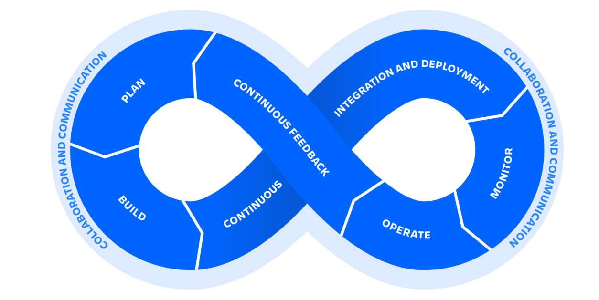

# **DevOps**

## O que é DevOps?

DevOps é um conjunto de práticas, ferramentas e uma filosofia cultural que automatiza e integra os processos entre o desenvolvimento de software e as equipes de TI. Ele enfatiza a capacitação da equipe, comunicação e colaboração entre equipes e automação de tecnologia.

O movimento DevOps [começou por volta de 2007](https://www.atlassian.com/devops/what-is-devops/history-of-devops), quando as comunidades de desenvolvimento de software e operações de TI levantaram preocupações sobre o modelo tradicional de desenvolvimento de software, onde os desenvolvedores que escreveram o código trabalharam separados das operações que implantaram e deram suporte ao código. O termo DevOps, uma combinação das palavras desenvolvimento e operações, reflete o processo de integração dessas disciplinas em um processo contínuo.

## Como o DevOps funciona?

Uma equipe de DevOps inclui desenvolvedores e operações de TI trabalhando de forma colaborativa durante todo o ciclo de vida do produto, a fim de aumentar a velocidade e a qualidade da implantação do software. É uma nova forma de trabalhar, uma mudança cultural, que tem implicações significativas para as equipes e as organizações para as quais trabalham.

Sob um modelo de DevOps, as equipes de desenvolvimento e operações não estão mais "isoladas". Às vezes, essas duas equipes se fundem em uma única equipe, onde os engenheiros trabalham em todo o ciclo de vida do aplicativo - do desenvolvimento e teste à implantação e operações - e têm uma variedade de habilidades multidisciplinares.

As equipes de DevOps usam ferramentas para automatizar e acelerar processos, o que ajuda a aumentar a confiabilidade. Um conjunto de ferramentas DevOps ajuda as equipes a lidar com fundamentos importantes do DevOps, incluindo integração contínua, entrega contínua, automação e colaboração.

Os valores de DevOps às vezes são aplicados a outras equipes além de desenvolvimento. Quando as equipes de segurança adotam uma abordagem DevOps, a segurança é uma parte ativa e integrada do processo de desenvolvimento. Isso é chamado de DevSecOps.

## O ciclo de vida DevOps

Devido à natureza contínua do DevOps, os profissionais usam o loop infinito para mostrar como as fases do ciclo de vida do DevOps se relacionam entre si. Apesar de parecer fluir sequencialmente, o loop simboliza a necessidade de colaboração constante e melhoria iterativa ao longo de todo o ciclo de vida.

O ciclo de vida do DevOps consiste em seis fases que representam os processos, recursos e ferramentas necessários para o desenvolvimento (no lado esquerdo do loop) e operações (no lado direito do loop). Ao longo de cada fase, as equipes colaboram e se comunicam para manter o alinhamento, a velocidade e a qualidade.

* _Plan_ - As equipes de DevOps devem adotar práticas ágeis para melhorar a velocidade e a qualidade. Agile é uma abordagem iterativa para gerenciamento de projetos e desenvolvimento de software que ajuda as equipes a dividir o trabalho em partes menores para entregar valor incremental.
* _Build_ - Git é um sistema de controle de versão de código aberto e gratuito. Ele oferece um excelente suporte para ramificação, fusão e reescrita do histórico do repositório, o que levou a muitos fluxos de trabalho e ferramentas inovadores e poderosos para o processo de construção de desenvolvimento.
* _Continuous integration and delivery_ - O CI / CD permite que as equipes lançem produtos de qualidade com frequência e de maneira previsível, do repositório de código-fonte à produção com fluxos de trabalho automatizados. As equipes podem mesclar alterações de código com frequência, implantar sinalizadores de recursos e incorporar testes de ponta a ponta.
* _Monitor and alert_ - Identifique e resolva rapidamente os problemas que afetam o tempo de atividade, a velocidade e a funcionalidade do produto. Notifique automaticamente sua equipe sobre mudanças, ações de alto risco ou falhas, para que você possa manter os serviços ativados.
* _Operate_ - Gerenciar a entrega ponta a ponta de serviços de TI aos clientes. Isso inclui as práticas envolvidas no design, implementação, configuração, implantação e manutenção de toda a infraestrutura de TI que oferece suporte aos serviços de uma organização.
* _Continuous feedback_ - As equipes de DevOps devem avaliar cada versão e gerar relatórios para melhorar as versões futuras. Ao coletar feedback contínuo, as equipes podem melhorar seus processos e incorporar o feedback do cliente para melhorar o próximo lançamento.

## DevOps tools

As ferramentas DevOps abordam as principais fases do ciclo de vida DevOps. Eles capacitam as práticas de DevOps, ajudando a melhorar a colaboração, reduzir a troca de contexto, introduzir automação e permitir observabilidade e monitoramento.

## Quais são os benefícios do DevOps?

Na [pesquisa de Tendências de DevOps de 2020](https://www.atlassian.com/whitepapers/devops-survey-2020) da Atlassian, 99 por cento dos entrevistados disseram que o DevOps teve um impacto positivo em sua organização. Os benefícios do DevOps incluem lançamentos mais rápidos e fáceis, eficiência da equipe, maior segurança, produtos de maior qualidade e, consequentemente, equipes e clientes mais felizes.

* _Speed_ - Equipes que praticam DevOps lançam entregas com mais frequência, com maior qualidade e estabilidade. Na verdade, o relatório DORA 2019 State of DevOps descobriu que as equipes de elite implantam 208 vezes mais frequentemente e 106 vezes mais rápido do que as equipes de baixo desempenho. A entrega contínua permite que as equipes criem, testem e entreguem software com ferramentas automatizadas.
* _Improved collaboration (Colaboração aprimorada)_ - A base do DevOps é uma cultura de colaboração entre desenvolvedores e equipes de operações, que compartilham responsabilidades e combinam trabalho. Isso torna as equipes mais eficientes e economiza tempo relacionado às transferências de trabalho e à criação de código projetado para o ambiente em que é executado.
* _Rapid deployment (Desenvolvimento rápido)_ - Ao aumentar a frequência e a velocidade dos lançamentos, as equipes de DevOps aprimoram os produtos rapidamente. Uma vantagem competitiva pode ser obtida lançando rapidamente novos recursos e reparando bugs.
* _Quality and reliability (Qualidade e confiabilidade)_ - Práticas como integração contínua e entrega contínua garantem que as mudanças sejam funcionais e seguras, o que melhora a qualidade de um produto de software. O monitoramento ajuda as equipes a se manterem informadas sobre o desempenho em tempo real.
* _Security_ - Ao integrar a segurança em uma integração contínua, entrega contínua e pipeline de implantação contínua, o DevSecOps é uma parte ativa e integrada do processo de desenvolvimento. A segurança é incorporada ao produto integrando auditorias de segurança ativas e testes de segurança ao desenvolvimento ágil e fluxos de trabalho DevOps.

## Práticas DevOps

* _Continuous integration_ - A integração contínua é a prática de automatizar a integração de alterações de código em um projeto de software. Ele permite que os desenvolvedores frequentemente mesclem alterações de código em um repositório central onde compilações e testes são executados. Isso ajuda as equipes de DevOps a resolver bugs mais rapidamente, melhorar a qualidade do software e reduzir o tempo necessário para validar e lançar novas atualizações de software.
* _Continuous delivery_ - A entrega contínua expande a integração contínua, implantando automaticamente as alterações de código em um ambiente de teste / produção. Ele segue um pipeline de entrega contínua, onde compilações, testes e implantações automatizados são orquestrados como um fluxo de trabalho de lançamento.
* _Consciência situacional_ - É vital que cada membro da organização tenha acesso aos dados de que precisam para realizar seu trabalho da maneira mais eficaz e rápida possível. Os membros da equipe precisam ser alertados sobre falhas no pipeline de implantação - seja sistêmica ou devido a testes com falha - e receber atualizações oportunas sobre a integridade e o desempenho dos aplicativos em execução na produção. Métricas, logs, rastreamentos, monitoramento e alertas são todas as fontes essenciais de feedback de que as equipes precisam para informar seu trabalho. 
* _Automação_ - A automação é uma das práticas de DevOps mais importantes porque permite que as equipes se movam muito mais rapidamente no processo de desenvolvimento e implantação de software de alta qualidade. Com a automação, o simples ato de enviar alterações de código a um repositório de código-fonte pode acionar um processo de construção, teste e implantação que reduz significativamente o tempo que essas etapas levam.
* _Infrastructure as Code (Infraestrutura como código)_ - Quer sua organização tenha um data center local ou esteja totalmente na nuvem, ter a capacidade de provisionar, configurar e gerenciar a infraestrutura de maneira rápida e consistente é a chave para a adoção bem-sucedida do DevOps. Infraestrutura como código (IaC) vai além de simplesmente criar scripts de configuração de infraestrutura para tratar suas definições de infraestrutura como código real: usando controle de origem, revisões de código, testes, etc. 
* _Microservices_ - Microsserviços é uma técnica arquitetônica em que um aplicativo é construído como uma coleção de serviços menores que podem ser implantados e operados independentemente uns dos outros. Cada serviço tem seus próprios processos e se comunica com outros serviços por meio de uma interface. Essa separação de interesses e função independente desacoplada permite práticas de DevOps como entrega contínua e integração contínua.
* _Monitoring (Monitoramento)_ - As equipes de DevOps monitoram todo o ciclo de vida de desenvolvimento - desde o planejamento, desenvolvimento, integração e teste, implantação e operações. Isso permite que as equipes respondam a qualquer degradação na experiência do cliente de forma rápida e automática. Mais importante, permite que as equipes “mudem para a esquerda” para os estágios anteriores de desenvolvimento e minimizem as interrupções nas mudanças de produção.
